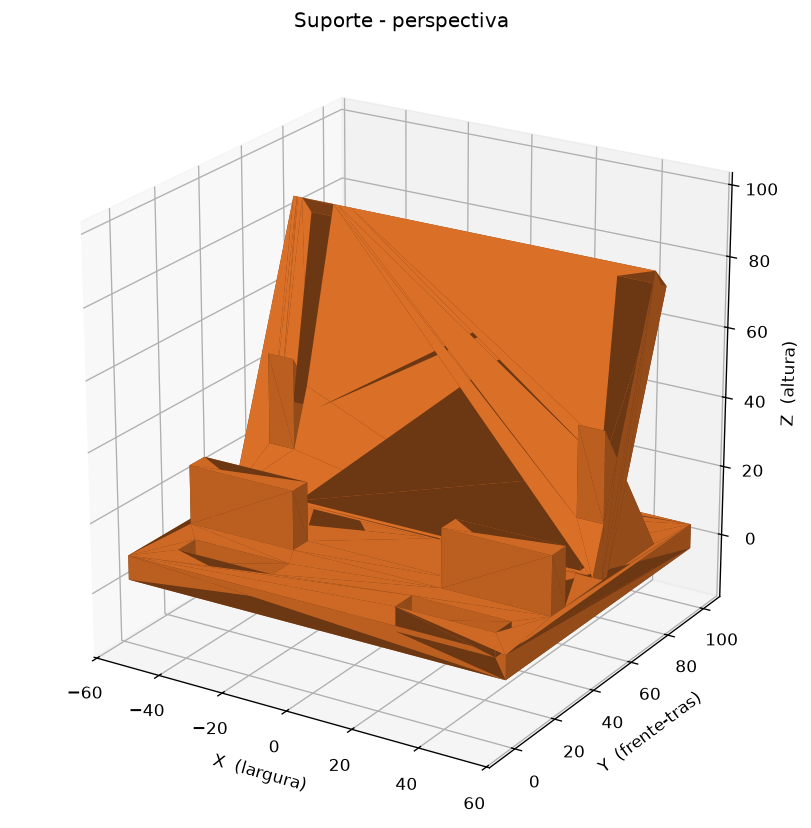
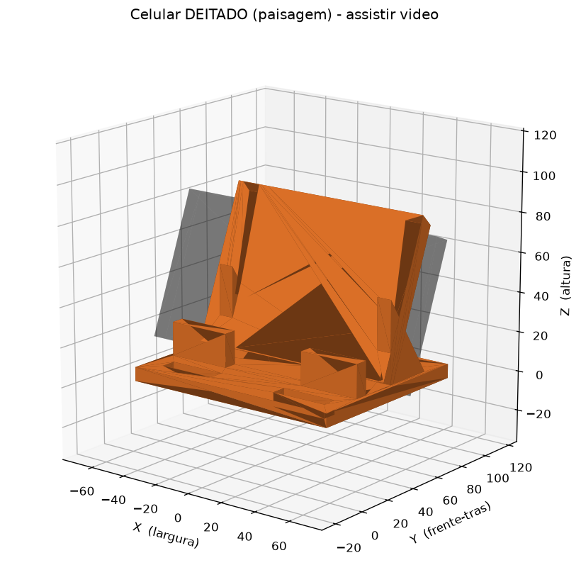
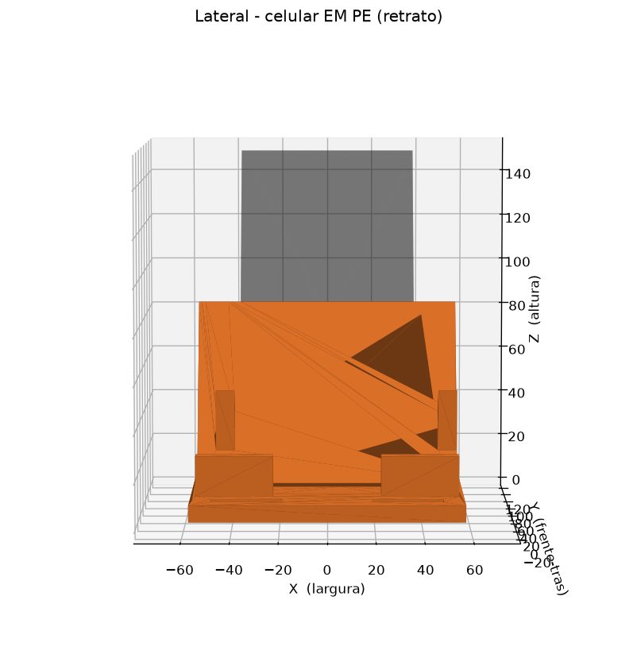
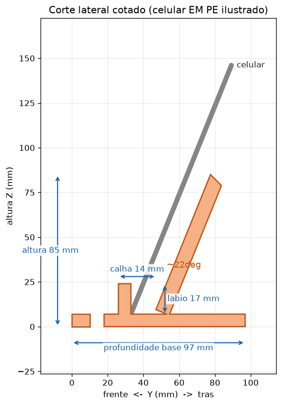

# Suporte de celular para bicicleta ergométrica (console Athletic)

Suporte para impressão 3D que **apoia sobre o topo do painel** da bike e segura
o celular **deitado (paisagem)** para assistir vídeos e **em pé (retrato)** para
Reels/Shorts — sem precisar segurar na mão durante o cardio.



## Como funciona

- **Base de apoio** que descansa em cima do console, com **dois passadores** para
  passar uma fita velcro / abraçadeira em volta do painel — assim ele apoia sem
  ferramenta, mas fica travado contra a vibração do pedal.
- **Encosto reclinado ~22°** + **calha inferior** que segura o celular em pé ou
  deitado. A reclinação deixa a tela virada para cima, na direção do seu rosto
  enquanto você pedala.
- **Recorte central** para passar o **cabo do carregador** (essencial para 30 min
  de vídeo) e que também serve de "pega‑dedo" para tirar o celular.

| Celular deitado (vídeo) | Em pé (Reels) | Corte com medidas |
|---|---|---|
|  |  |  |

## Medidas da peça

- Tamanho final: **116 × 97 × 85 mm** (L × P × A)
- Calha do celular: **14 mm** (cabe celular com capa de até ~14 mm de espessura)
- Filamento: **~64 g** · tempo aprox.: **4 a 6 h**

Serve para praticamente qualquer celular: em pé o aparelho encosta a traseira no
painel e a base fica na calha; deitado ele sobra para os lados sem problema (o
recorte central fica embaixo do meio do aparelho, onde costuma ficar a entrada
do cabo).

## ⚠️ Material — atenção ao sol

Pelas fotos, a bike fica em **área externa, exposta ao sol**. Nesse caso **não use
PLA**: ele começa a amolecer perto de 55–60 °C e um suporte parado no sol pode
entortar. Prefira, nesta ordem:

1. **PETG** (recomendado) — barato, aguenta bem o calor e o sol.
2. **ASA** — melhor ainda para exterior/UV, se a gráfica tiver.
3. PLA **só** se a bike ficar sempre na sombra / área coberta.

## 🖨️ Configurações de impressão

| Parâmetro | Valor |
|---|---|
| Orientação | **base para baixo** (do jeito que o modelo já vem) |
| Suportes | **não precisa** |
| Altura de camada | 0,2 mm |
| Paredes/perímetros | 3 |
| Preenchimento (infill) | 20 % |
| Material | PETG ou ASA (ver acima) |

O arquivo pronto é **`bike_phone_holder.stl`** — é só mandar para a impressora /
gráfica de impressão 3D.

## 🔧 Montagem e fixação

1. **Antiderrapante:** cole um pedaço de **EVA / borracha / fita dupla‑face de
   espuma** embaixo da base. Como o topo do console é curvo, a espuma acomoda e
   evita que escorregue.
2. **Trave com uma correia:** passe uma **fita velcro** (ou abraçadeira/zip‑tie)
   pelos **dois passadores** da base e por baixo/em volta do console. Isso segura
   firme mesmo pedalando forte.
3. **Cabo do carregador:** passe pelo **recorte central** e ligue na entrada do
   celular. Dá para assistir os 30 min carregando.
4. Encaixe o celular na calha, encostado no encosto — em pé ou deitado.

> **Segurança:** com o velcro/abraçadeira ele fica bem preso. Se for pedalar em pé
> ou muito forte, confira se a correia está firme antes.

## Quer ajustar a medida?

O modelo é **paramétrico**. No topo do arquivo `generate.py` estão as medidas
(largura, altura, ângulo de reclinação, folga da calha etc.). Basta editar e rodar:

```bash
pip install trimesh manifold3d shapely scipy numpy matplotlib
python3 generate.py
```

Isso gera o `.stl` novo e as imagens de prévia. Se preferir, me diga a espessura do
seu celular **com capa** e a largura do topo do painel que eu gero a versão exata.
